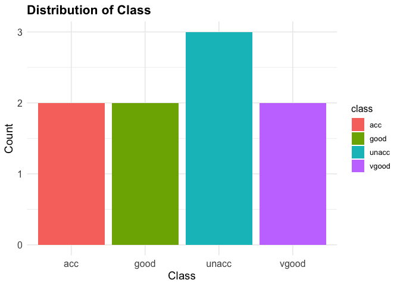
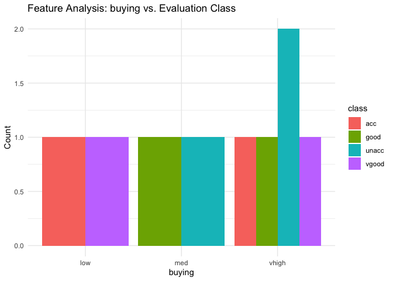
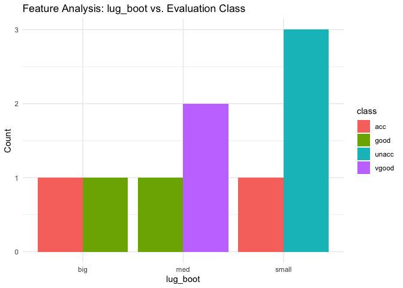
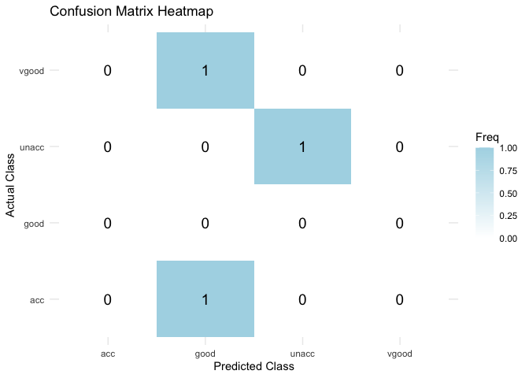

<!-- README.md is generated from README.Rmd. Please edit that file -->

# predictcarcategory

<!-- badges: start -->

[](https://github.com/DSCI-310-2025/predictcarcategory/actions/workflows/R-CMD-check.yaml)
[](https://app.codecov.io/gh/DSCI-310-2025/predictcarcategory)

<!-- badges: end -->

The goal of predictcarcategory is to provide tools for exploratory
analysis and predictive modeling related to car evaluation categories.
The package includes functions to generate bar plots for categorical
features, train random forest models, and visualize confusion matrices.

## Installation

You can install the development version of predictcarcategory from
[GitHub](https://github.com/) with:

``` r
# install.packages("pak")
pak::pak("DSCI-310-2025/predictcarcategory")
```

## Usage

A common task when dealing with car data involves creating a bar plot
for one categorical variable, creating a list of bar plots comparing
categorical features to the class target variable, training and testing
a random forest model and creating a heatmap to visualize the confusion
matrix. This is where functions like generate_barplot(),
generate_feature_plots(), and analysis_model() and
generate_confusion_matrix_heatmap() are useful.

``` r
library(predictcarcategory)

# Sample dataset
df <- data.frame(
  buying = c("vhigh", "vhigh", "vhigh", "vhigh", "vhigh", "low", "med", "low", "med"),
  maint = c("vhigh", "vhigh", "vhigh", "vhigh", "vhigh", "low", "low", "med", "med"),
  doors = c("2", "2", "2", "2", "2", "3", "3", "4", "5more"),
  persons = c("2", "2", "2", "2", "2", "4", "4", "more", "more"),
  lug_boot = c("small", "small", "small", "med", "med", "big", "big", "med", "small"),
  safety = c("low", "med", "high", "low", "med", "high", "low", "med", "high"),
  class = c("unacc", "unacc", "acc", "good", "vgood", "acc", "good", "vgood", "unacc")
)

generate_barplot(dataset = df, x = "class", x_name = "Class")
```



generate_barplot() creates a bar plot to visualize the distribution of
the target variable. It makes it easier to see how balanced or
imbalanced the classes are within the dataset.

``` r
category_features <- c("buying", "maint", "doors", "persons", "lug_boot", "safety")
plot_list <- generate_feature_barplots(data = df, features = category_features)
# Display the first and second plot as an example
plot_list[[1]]
```



``` r
plot_list[[5]]
```



generate_feature_barplots() creates a list of bar plots to visualize the
relationship between the categorical variables and the target variable.
It makes it easier to identify the trends and patterns.

``` r
df_balanced <- df
df_balanced[] <- lapply(df_balanced, as.factor)
conf_mat <- apply_random_forest(df_balanced)
conf_mat
#> Confusion Matrix and Statistics
#> 
#>           Reference
#> Prediction acc good unacc vgood
#>      acc     0    0     0     0
#>      good    1    0     0     1
#>      unacc   0    0     1     0
#>      vgood   0    0     0     0
#> 
#> Overall Statistics
#>                                           
#>                Accuracy : 0.3333          
#>                  95% CI : (0.0084, 0.9057)
#>     No Information Rate : 0.3333          
#>     P-Value [Acc > NIR] : 0.7037          
#>                                           
#>                   Kappa : 0.25            
#>                                           
#>  Mcnemar's Test P-Value : NA              
#> 
#> Statistics by Class:
#> 
#>                      Class: acc Class: good Class: unacc Class: vgood
#> Sensitivity              0.0000          NA       1.0000       0.0000
#> Specificity              1.0000      0.3333       1.0000       1.0000
#> Pos Pred Value              NaN          NA       1.0000          NaN
#> Neg Pred Value           0.6667          NA       1.0000       0.6667
#> Prevalence               0.3333      0.0000       0.3333       0.3333
#> Detection Rate           0.0000      0.0000       0.3333       0.0000
#> Detection Prevalence     0.0000      0.6667       0.3333       0.0000
#> Balanced Accuracy        0.5000          NA       1.0000       0.5000
```

apply_random_forest() applies RandomForest algorithm to the dataset and
returns the confusion matrix. It helps evaluate the classification
performance of the model by splitting the data into training and testing
sets, fitting a Random Forest, and summarizing the results through a
confusion matrix.

``` r
conf_df <- data.frame(conf_mat$table)
generate_confusion_matrix_heatmap(conf_df)
```



generate_confusion_matrix_heatmap() creates a heatmap for confusion
matrix. It makes it easier to interpret model performance.

## Position in the R Package Ecosystem

The predictcarcategory package is a specialized tool in the R ecosystem
designed to streamline exploratory data analysis (EDA) and predictive
modeling for car evaluation classification problems. It provides
easy-to-use functions for visualizing categorical data, training random
forest models, and evaluating model performance. While general-purpose
EDA packages (e.g., `ggplot2`, `dplyr`) and machine learning packages
(e.g., `caret`, `randomForest`) offer broader tools for all kinds of
datasets and tasks, predictcarcategory is specifically geared towards
classification problems. It streamlines the workflow from data
exploration to model evaluation with minimal user effort.
